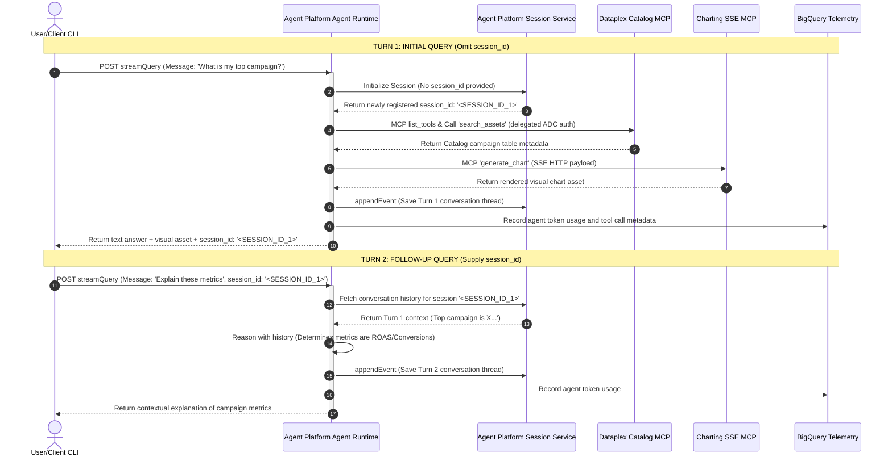

# 📐 System Architecture: Dataplex Catalog & Charting Agent

This document details the architectural layout, system boundaries, and transactional sequence flows of the **Gagent-Skills** ecosystem.

---

## 1. System-Context Layout

The diagram below highlights how the client layer, Agent Platform Agent Runtime, and various Model Context Protocol (MCP) servers interact under delegated authentication.

```mermaid
graph TD
    classDef primary fill:#4285F4,stroke:#333,stroke-width:2px,color:#fff;
    classDef secondary fill:#34A853,stroke:#333,stroke-width:1px,color:#fff;
    classDef external fill:#EA4335,stroke:#333,stroke-width:1px,color:#fff;
    classDef state fill:#FBBC05,stroke:#333,stroke-width:1px,color:#000;

    subgraph Client Layer
        C["Client Application / Agy CLI"]:::primary
    end

    subgraph Google Cloud Platform (us-central1)
        subgraph Agent Platform Agent Runtime
            ADK["google-adk Agent Engine App<br>(gagent-skills)"]:::primary
            BQ_P["BigQuery Analytics Plugin"]:::secondary
        end

        subgraph GCP Managed Services
            DP_MCP["Dataplex Catalog MCP Server<br>(dataplex.googleapis.com/mcp)"]:::external
            BQ_D[("BigQuery Telemetry Dataset<br>(adk_agent_analytics)")]:::state
            SES[("Agent Platform Session Service")]:::state
        end
    end

    subgraph Cloud Run Microservices
        CH_MCP["Charting MCP Server<br>(SSE Endpoint)"]:::external
    end

    %% Client Interactions
    C -->|1. Direct SDK/REST Call| ADK
    
    %% ADK Tool Integrations
    ADK -->|2. Query Metadata| DP_MCP
    ADK -->|3. Generate Visuals| CH_MCP
    
    %% Session & Telemetry Logs
    ADK -->|4. Register State| SES
    ADK -->|5. Record Telemetry| BQ_P
    BQ_P -.->|Stream Logs| BQ_D
```

---

## 2. Dynamic Execution Sequence (Multi-Turn Conversational Session)

This sequence diagram illustrates the transaction flow across **Turn 1 (Initial Message with session creation)** and **Turn 2 (Follow-up Message with thread recall)**.



---

## 3. Core Architectural Highlights

1.  **Framework Standardization:** The core agent logic leverages `google.adk`'s centralized `App` structure, replacing low-level REST routing wraps with high-level agent scaffolding.
2.  **Stateless/Stateful Dual-Mode Routing:** The ADK container remains stateless. It delegates all session storage, event histories, and context state trees to the managed **Agent Platform Session Service** database. This ensures scaling across active instances is completely seamless.
3.  **Delegated Credential Chain:** Rather than embedding service account JSON keys or long-lived keys, the agent utilizes a dynamic Application Default Credentials (ADC) token negotiation pattern. It extracts the OAuth2 token from the active execution container context and injects it into both downstream MCP servers.
4.  **Integrated Observability:** Every model invocation, tool activation, token usage statistic, and latency metric is intercepted by the `BigQueryAgentAnalyticsPlugin` and streamed straight into BigQuery.
